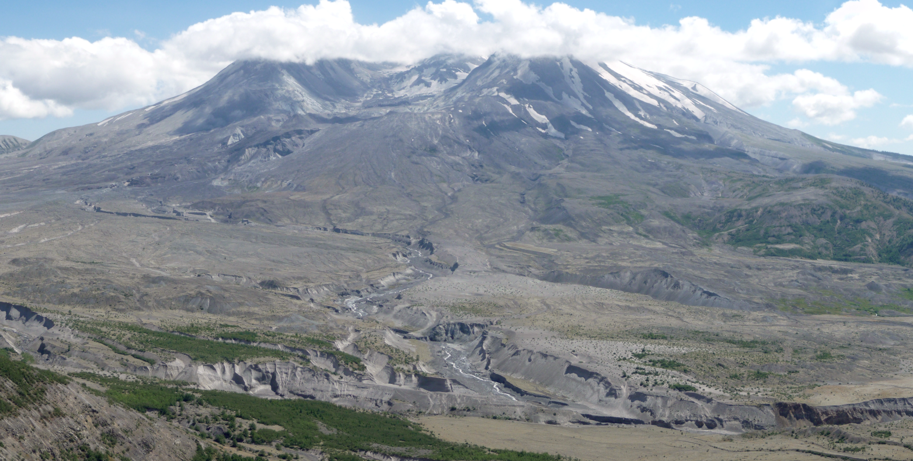

# Advancing Geophysical Research with Cloud Computing

The material in this workshop was presented at the Annual Meeting of the Seismological Society of America in Pasadena in April, 2026. 

This workshop covers the following topics:
1. Environment Selection + Resource Allocation
2. Data Download: comparing serial and concurrent approaches
3. Data Pre-processing with parallel computing
4. Putting 2&3 together: efficient computing with in-stream processing
5. Science Example: Matched Filtering Cross Correlation
6. Saving data and work

We recommend you follow <SSA 2026 Workshop.pdf> in this repository as a guide as you work through the notebooks. Please note some links in the pdf may have changed since the live workshop.

**WARNING: KNOWN PERFORMANCE ISSUES:**
The techniques in this notebook highlight a variety of ways to execute parallelization and scaling operations in general cloud context. However, they can hit one major point of failure when operating in GeoLab: the /home storage drive in GeoLab is not optimized for high-throughput read/write operations on moderate-to-large amounts of data.

When running these notebooks as written in GeoLab, you may encounter lags in read-write operations that negate the speed-savings of the parallelization techniques being practiced. In severe instances, and depending on the activity of other users in the hub, GeoLab may become unstable and result in crashed kernels. 

We highly recommend that instead of writing intermediate data to your /home/jovyan user storage, you adapt the code to make use of an ephemeral storage solution, such as a /tmp folder or scratch bucket, or you write data to an S3 bucket in your own AWS account. More details on these approaches can be found in [our platform documentation](https://docs.earthscope.org/geolab/getting-started/user-storage).

